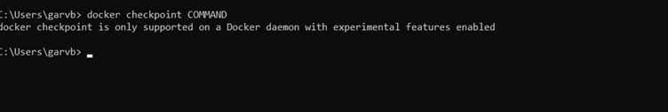
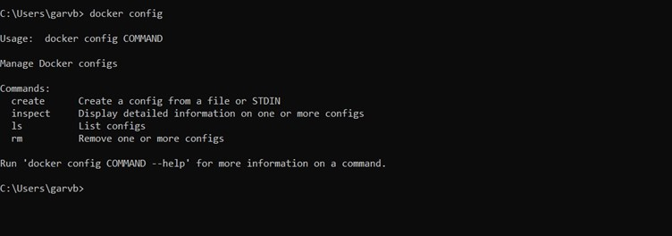
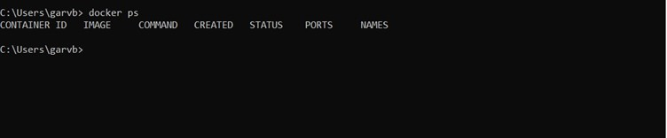
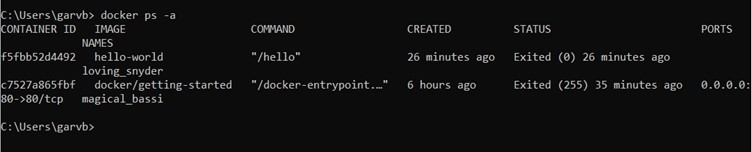
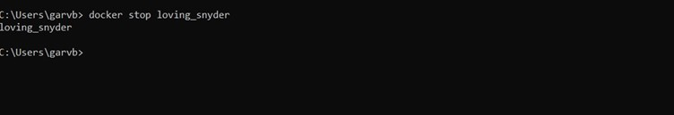
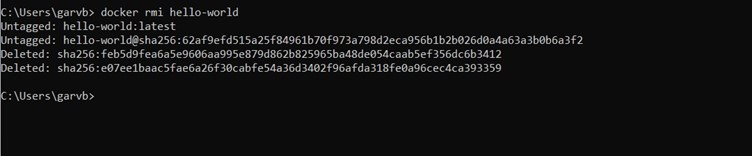
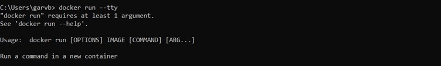
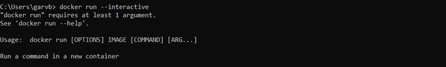
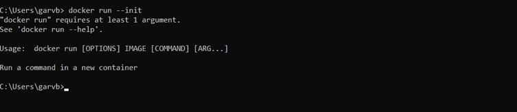

# Docker Assignments :-

## Assignment 1 

```
docker pull hello-world
```


```
docker run hello-world
```


```
docker images
```


```
docker checkpoint COMMAND
```


```
docker config command
```


```
docker ps
```


```
docker ps -a
```


```
docker stop <name>
```


```
docker rm <name>
```


```
docker rmi <name>
```


```
docker run -help
```


```
docker run -tty
```


```
docker run -interactive
```


```docker run -label list
```


```
docker run -init
```


